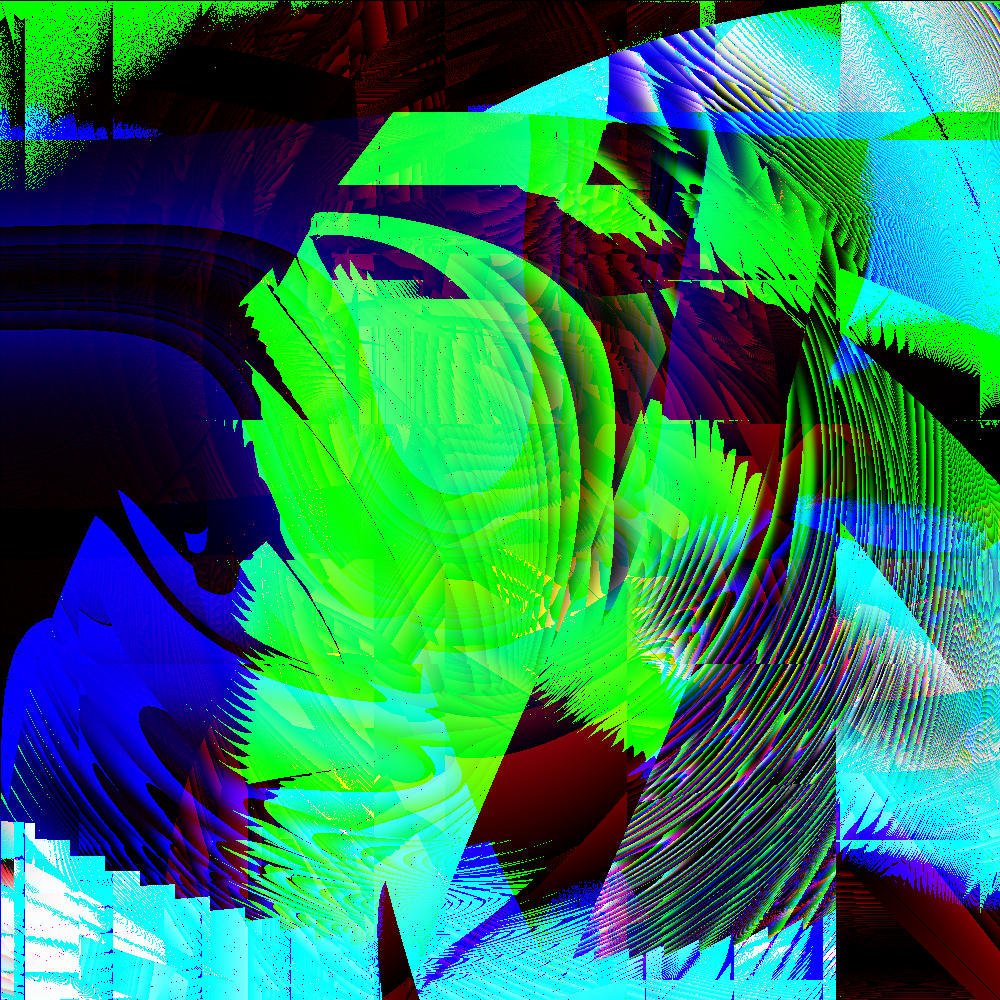

# Random Art Generator

This project generates random art images based on a grammar that defines a set of operations and how they can be
combined. The grammar uses a seed to produce a tree-like structure of operations, which are then evaluated to create a
color value for each pixel in the output image. It also allows you to render the generated art in a window using a
simple shader.


## Usage

### Building

To build the project, you need to have Rust and Cargo installed. Then, navigate to the project directory in your
terminal and run:

```bash
cargo build --release
```

This will create an optimized executable in the `target/release/` directory.

### Running

You can run the project using Cargo:

```bash
cargo run --release -- [options]
```

#### Options

- `-s`, `--seed <SEED_STRING>`: Sets a custom seed for the random number generator. The seed can be a string or an
  integer. If no seed is provided, the current time is used as the seed.
- `-d`, `--depth <DEPTH>`: Sets the depth of the expression tree to generate. The default value is `5`.
- `-o`, `--output <OUTPUT_FILE>`: Sets the output file name for the generated image. The default value is
  `generated/random_art.png`.
- `-r`, `--render_mode <RENDER_MODE>`: Select render mode. Possible values are `file` (render to a file) and `window` (
  render to a window).

#### Examples

Generate an image with a specific seed:

```bash
cargo run --release -- -s "my_custom_seed" -o "output/my_image.png"
```

Generate an image with a random seed (based on the current time) and save it to the default location:

```bash
cargo run --release
```

Generate an image with a numeric seed and a depth of 7:

```bash
cargo run --release -- -s 12345 -d 7 -o "seed_12345_depth_7.png"
```

Render to a window with a specific seed and a depth of 10:

```bash
cargo run --release -- -s "my_window_seed" -d 10 -r window
```

### Example Images

The `examples/` directory contains some example images generated by the program. Here are a few examples presented in a
table:

| Image                                                                                        | Seed                             | Depth |
|----------------------------------------------------------------------------------------------|----------------------------------|-------|
|   | 7d3e25258f36b0c4de712969b13fb031 | 5     |
|                                    | 8e2d537406dcb677                 | 5     |
|                                    | 89c5c8b2f6ecbb74                 | 5     |
|    | 141b38c32ba9a283dcd2db6b482b8259 | 5     |
|                                    | 32822bf7da3b063e                 | 5     |
|    | bec07cf2eb7fd31affa6081ee1b18845 | 5     |
|  | d561f7618bdf18f7f0622c99408e609a | 10    |

## Future Improvements

- **Offscreen Rendering for Shaders:** Add a way to save the output of the `WindowRenderer` (which uses a shader) to a
  PNG file. This will involve offscreen rendering techniques.
- **GPU-based Renderer:** Implement a full-fledged GPU-based renderer (`GPURenderer`) using a compute shader to
  significantly improve performance, especially for higher resolutions and complex expressions. Consider using libraries
  like `wgpu`.
- **Animation Generation:**
    - Add an option to generate animations by varying the expression tree over time (e.g., by modifying the `t` variable
      or changing the seed).
    - Implement a way to save animations as a sequence of PNG files or directly as a video file (using a library like
      `ffmpeg`).
- **More Operations:** Add more operations to the grammar to create more complex and varied images:
    - Trigonometric functions (`cos`, `tan`, `atan2`).
    - Noise functions (Perlin noise, Simplex noise).
    - Fractal functions (Mandelbrot set, Julia set).
    - Conditional operations (`if-else`).
    - Image loading (load an image and use it as input).
- **Configurable Probabilities:** Allow configuring the probabilities of each operation in the grammar, potentially
  through a configuration file.
- **Graphical User Interface (GUI):** Develop a GUI to make it easier to interact with the program, allowing users to:
    - Adjust parameters (seed, depth, operation probabilities).
    - Select the renderer (file, window, GPU).
    - Preview the generated art.
    - Save images and animations.
    - Consider using GUI frameworks like `egui`, `iced`, or `druid`.
- **Multithreading:** Parallelize the pixel evaluation in `FileRenderer` using threads (e.g., with the `rayon` crate)
  for performance gains.
- **Caching:** Implement caching to store the results of sub-tree evaluations to avoid redundant computations.
- **SIMD:** Explore using SIMD instructions for pixel operations to improve performance.
- **Configuration File:** Allow users to define custom grammars and settings in a configuration file (e.g., TOML or
  YAML).
- **Testing:** Add comprehensive unit tests to ensure code correctness and prevent regressions.

## License

This project is licensed under the MIT License.

